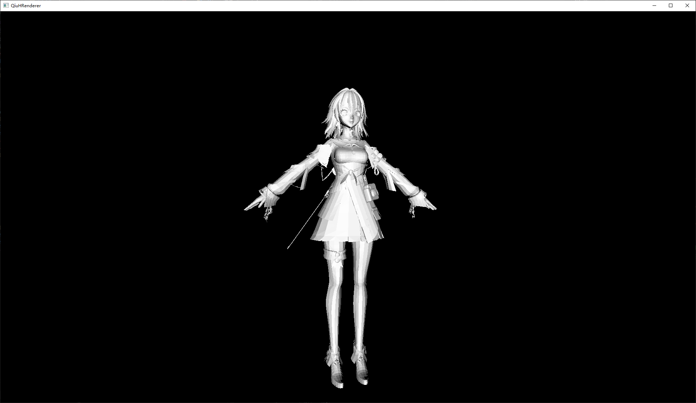
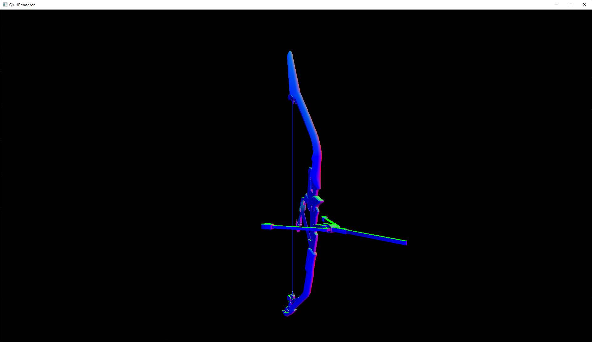
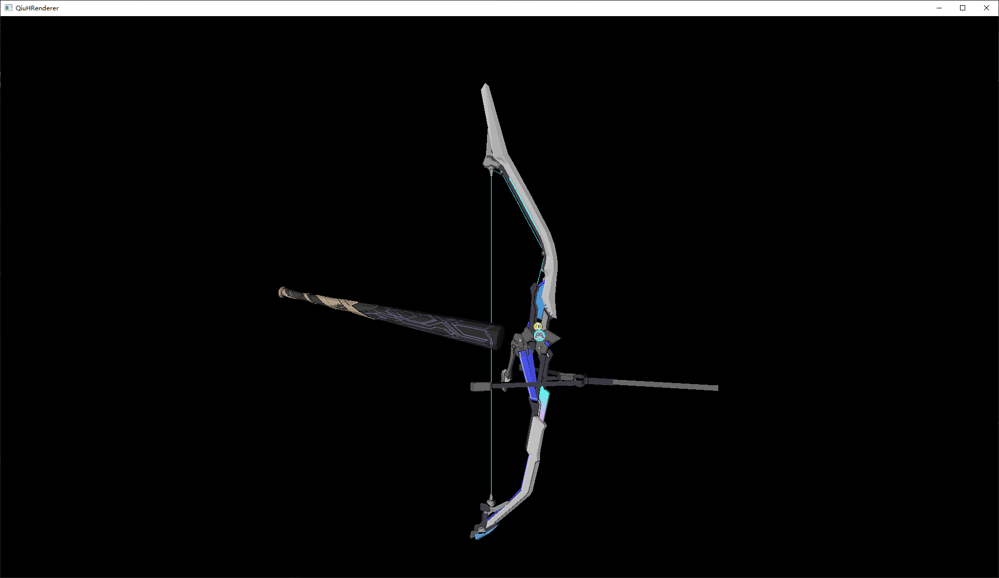

# QiuHRenderer
撸一个软光栅渲染器

```伪代码
//渲染架构：
	//传入模型、读取光照信息
	//--for(每个面)
	//		定义v2f结构体数组vertexout[3]
	//		
	//		--for(3个顶点)
	//			GetVertexData获取当前顶点appdate_base顶点信息
	//									{顶点位置、顶点UV、顶点法线}
	//			VertexShader给v2f赋值
	//						  {裁剪空间坐标、世界空间坐标、世界空间法线、顶点UV}
	//		----
	//		
	//		透视除法->齐次裁剪空间：简单粗暴的放弃这个面片 continue!(因为写渲染器的目标在于捋清楚渲染流水线，所以不做深挖)
	// 
	//		屏幕映射->屏幕空间：三角形设置
	//			基于三角形GetAABB获取BoudingBox
	// 
	//		三角形遍历
	//		--for(BoundingBox)
	//			IsInTriangle叉乘判断片元是否在三角形内
	//			-if(在三角形内部)
	//				GetBarycentric获取屏幕上的重心坐标
	//				插值计算出该片元在candidate cube 中的z值->获取candidate cube 中的坐标
	//				齐次裁剪空间的坐标转换到相机空间中
	//				利用透视除法系数，反推出裁剪空间中的深度值fragDepth
	// 
	//				判断fragDepth与zbuffer内的深度值
	//				if(fragDepth.abs < zbuffer[])
	//					写入当前深度值
	//					FragmentShader输出片元颜色color4
	//					DrawPixel
	//				else
	//				  不进行任何处理
	//			-else
	//				continue
	//		----
```


## devLog

### 20230426-成功封装Render Pilpline

把Render Pipeline封装在了Rasterrizer中的ExeRenderPileline中，架构同最基本的渲染流水线架构：（Legacy，此版本与实际管线不合，已被迭代）

```伪代码
//渲染架构：
	//传入模型、读取光照信息
	//--for(每个面)
	//		定义v2f结构体数组
	//		--for(3个顶点)
	//			GetVertexData获取当前顶点appdate_base顶点信息
	//			VertexShader给v2f赋值
	//		----
	//		使用v2f信息:
	//		GetAABB获取BoudingBox
	//		--for(BoundingBox)
	//			GetBarycentric获取重心坐标
	//			-if(在三角形内部)
	//				FragmentShader输出片元颜色color4
	//				DrawPixel
	//			-else
	//				continue
	//		----
```

> Debug实记：
>
> 在第一遍写出Render Pipeline的时候，模型不能正确显示，使用和原本代码同样的摄像机配置和变换
>
> 然后就开始了暴力Debug（添加各种宏定义，来定义输出各个渲染部分的输出：
>
> - #define DEBUG_SINGLEFRAME ： 只渲染一帧
> - #define LEGACY ： 看看执行原本的代码得到的各个信息长什么样子（后续版本这一段会被我删掉）
> - #define DEBUG_VERT ： 监测顶点着色器执行后顶点的世界空间坐标、屏幕空间坐标和透视系数如何
> - #define DEBUG_DATASTREAMING ： 查看信息流送状态（此时Debug显示为v2f内的信息）
>
> 当我逐个内容和原本代码对比之后，发现空间变换都是没问题的，这个时候想到了问题可能出在屏幕映射（从[-1 ,1]映射到[screen.width, screen.height]）。然后好好看了看，果然，v2f传输给后续阶段的屏幕空间坐标是Candidate Cube中的坐标，没有映射到屏幕（窗口）的大小上，导致传递给**构建BoundingBox**的函数和**获取片元重心坐标**的函数接收到的ScreenTriangle参数不正确。
>
> 后续便在VertexShader之后加入了ScreenMapping函数，让ScreenTriangle的x、y处于屏幕（窗口）的空间中


### 20230428-修正Render Pipeline，实现正确的Clipping和ZBuffer

```伪代码
//渲染架构：
	//传入模型、读取光照信息
	//--for(每个面)
	//		定义v2f结构体数组vertexout[3]
	//		
	//		--for(3个顶点)
	//			GetVertexData获取当前顶点appdate_base顶点信息
	//									{顶点位置、顶点UV、顶点法线}
	//			VertexShader给v2f赋值
	//						  {裁剪空间坐标、世界空间坐标、世界空间法线、顶点UV}
	//		----
	//		
	//		透视除法->齐次裁剪空间：简单粗暴的放弃这个面片 continue!(因为写渲染器的目标在于捋清楚渲染流水线，所以不做深挖)
	// 
	//		屏幕映射->屏幕空间：三角形设置
	//			基于三角形GetAABB获取BoudingBox
	// 
	//		三角形遍历
	//		--for(BoundingBox)
	//			IsInTriangle叉乘判断片元是否在三角形内
	//			-if(在三角形内部)
	//				GetBarycentric获取屏幕上的重心坐标
	//				插值计算出该片元在candidate cube 中的z值->获取candidate cube 中的坐标
	//				齐次裁剪空间的坐标转换到相机空间中
	//				利用透视除法系数，反推出裁剪空间中的深度值fragDepth
	// 
	//				判断fragDepth与zbuffer内的深度值
	//				if(fragDepth.abs < zbuffer[])
	//					写入当前深度值
	//					FragmentShader输出片元颜色color4
	//					DrawPixel
	//				else
	//				  不进行任何处理
	//			-else
	//				continue
	//		----
```

实现的效果：




### 20230428-法线平滑

三角形的重心坐标不支持透视变换：屏幕空间上计算出来的片元的重心坐标与线性空间中计算出的片元对应的点的重心坐标不等，所以一些空间属性（法线、深度等）直接使用屏幕空间计算出的重心坐标进行插值是不正确的，需要利用透视除法的系数将重心坐标还原回线性空间，再在线性空间中进行插值。

```伪代码
//--FragmentShader(v2f*<三个顶点的：裁剪空间位置、世界空间位置、世界空间法线、UV>, w, barycoord)
//  -插值获得当前片元的fragW
//  -使用fragW将重心坐标还原回线性空间中
//	-使用线性空间的重心坐标插值计算片元的法线
// 	-使用法线信息进行相关计算
```

实现效果：




### 20230429-贴图映射

在FragmentShader中，通过屏幕空间的三角形重心坐标插值计算出当前片元的UV坐标，根据UV坐标去读取贴图即可（使用了[TinyRenderer](https://github.com/ssloy/tinyrenderer)教程中提供的TGA图片读取类实现图片加载进入内存）

注意：获取到的UV空间坐标需要还原到贴图图像空间来读取贴图颜色信息，UV空间是[0 , 1]，而贴图图像空间则是[width, height]

实现效果：




